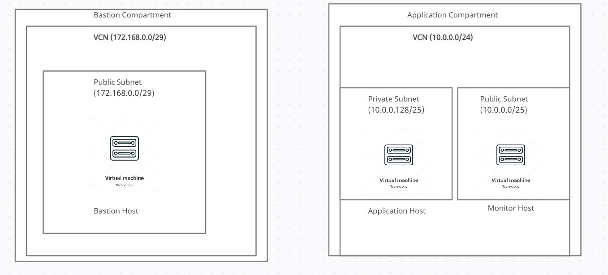

### Deployment Architecture

### Teck-stack
1. Terraform for OCI infrastructure provisioning
2. Ansible for application deployment
3. Dropwizard for microservice framework
4. Docker to bundle
5. TravisCi for Integration 

### Installation sequence
1. Push code to github repo
3. TravisCi builds the docker image and pushed to DockerHub
2. Deploy the network topology and application using the scripts in network

### Dropwizardexamples
How to start the Dropwizardexamples application
---

1. Run `mvn clean install` to build your application
1. Start application with `java -jar target/dropwizard-examples-1.0-SNAPSHOT.jar server config.yml`
1. To check that your application is running enter url `http://localhost:8080`

Health Check
---

To see your applications health enter url `http://localhost:8081/healthcheck`
